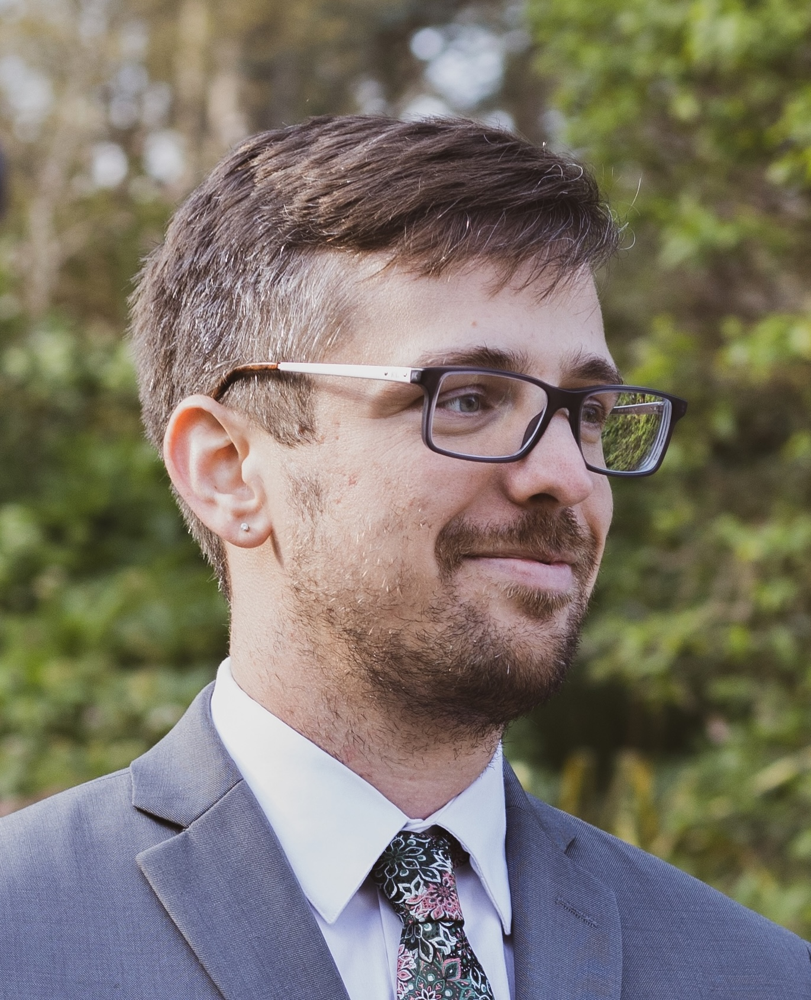

::: {.hero}

{.hero__portrait fig-alt="Portrait of Caleb H. Schmotter"}

::: {.hero__copy}

[Comparative Politics · Political Behavior]{.eyebrow}

<h1 class="hero__name">Caleb H. Schmotter</h1>

::: {.hero__role}

Visiting Assistant Professor of Political Science 
**St. Olaf College**

:::

::: {.boundary-rule .boundary-rule--short}
:::

::: {.hero__thesis}

For over a decade I have been putting students into rooms where they must argue as delegates, monarchs, and ministers, and where the outcome is genuinely in doubt. My research comprises two book projects: the first centers on the formation and evolution of ethnic boundaries, while the second tests the impact of public support on judicial independence.

:::

:::

:::

[Currently Teaching · Fall 2026]{.eyebrow}

::: {.now}

::: {.now__item}

[PSCI 220]{.now__code}

::: {.now__title}

Analyzing Politics

:::

::: {.now__desc}

The required sophomore methods course, covering case studies, ethnography, archival research, content analysis, surveys, experiments, statistical modeling, and R. Students learn how to conduct research, present results, and understand "how we know what we know" in political science.

:::

:::

::: {.now__item}

[PSCI 258]{.now__code}

::: {.now__title}

World Politics

:::

::: {.now__desc}

A sophomore course in international relations built around negotiation skills and analysis. Five in-class simulations lead into the capstone: a five-week reconstruction of the Congress of Vienna in which students take assigned diplomatic roles, write to their sovereigns, and argue the fate of post-Napoleonic Europe across plenary sessions and commissions. Throughout the semester, they also keep a journal of negotiations from their own lives with the goal of improving their ability to self-advocate while also reaching sustainable agreements. 

:::

:::

:::

[In the Classroom]{.eyebrow}

::: {.classroom}

My first classroom was a Reacting to the Past seminar at Drake in 2010, where over three years I served as a teaching assistant for four games: Henry VIII and the Reformation Parliament; The Threshold of Democracy: Athens in 403 B.C.; Defining a Nation: India on the Eve of Independence, 1945; and Confucianism and the Succession Crisis of the Wanli Emperor, 1587. I taught the Athens game on my own at Guangxi Normal University in 2015, and I have since built original courses on the same model – *Tyrants, Demagogues, and Democrats* draws on the Athens and India games, and *Maladroit Monarchs* on the English and Ming ones. This fall I am running the Congress of Vienna for the first time, as the capstone of World Politics. The method asks students to take on historical figures and argue toward outcomes that remain genuinely uncertain, governed by primary texts, by the victory conditions each player is handed in private, and above all by the actions of other students, which no amount of preparation on my part can predict and which regularly deliver results that the historical record did not. If I simply tell a class that coalitions are fragile, they may or may not remember it; if a student spends three weeks assembling one and then watches it come apart in the session before the final vote, the lesson tends to stick. The difference is not subtle. In this way, fifteen years of this work have convinced me that the most durable thing a simulation teaches is not just its historical content but the procedural intuition underneath it.

:::

[Recent Work]{.eyebrow}

::: {.work}

::: {.work__item}

::: {.work__title}

The Dimensions of Ethnicity: Understanding the Cognitive Architecture of Ethnic Group Membership

:::

::: {.work__meta}

*Journal of Race, Ethnicity, and Politics*, 2026

:::

::: {.work__note}

The article rests on two original experiments fielded in May 2024 under a Rapoport Family Foundation dissertation grant: a survey experiment among 1,800 White, Black, and Latino adults, and a conjoint among 900 Latino adults. Work of this kind provides many opportunities for undergraduate students to experience the research process, from designing surveys to cleaning data to analyzing and interpreting results.

:::

:::

::: {.work__item}

::: {.work__title}

Public Support and the Survival of High Courts

:::

::: {.work__meta}

With Brandon Bartels and Eric Kramon · Two papers under revision

:::

::: {.work__note}

A Bayesian dynamic latent trait model pooling survey data across time and space to estimate public support for high courts in 145 countries since 1981. The measure itself is under revision at *Political Science Research and Methods*; the substantive finding, that elite attacks raise the likelihood of court-curbing and that public support significantly attenuates that link, is under revision at *Comparative Political Studies*.

:::

:::

:::

[All publications and working papers →](research.html){.more}

[Curriculum Vitae]{.eyebrow}

<a class="dl" href="cv/schmotter-cv.pdf" target="_blank">Download CV (PDF)</a>
